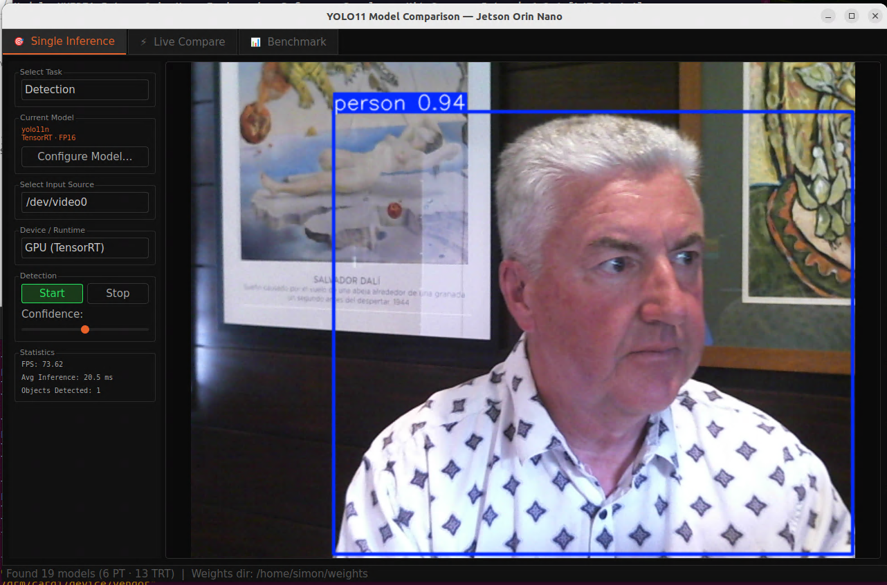
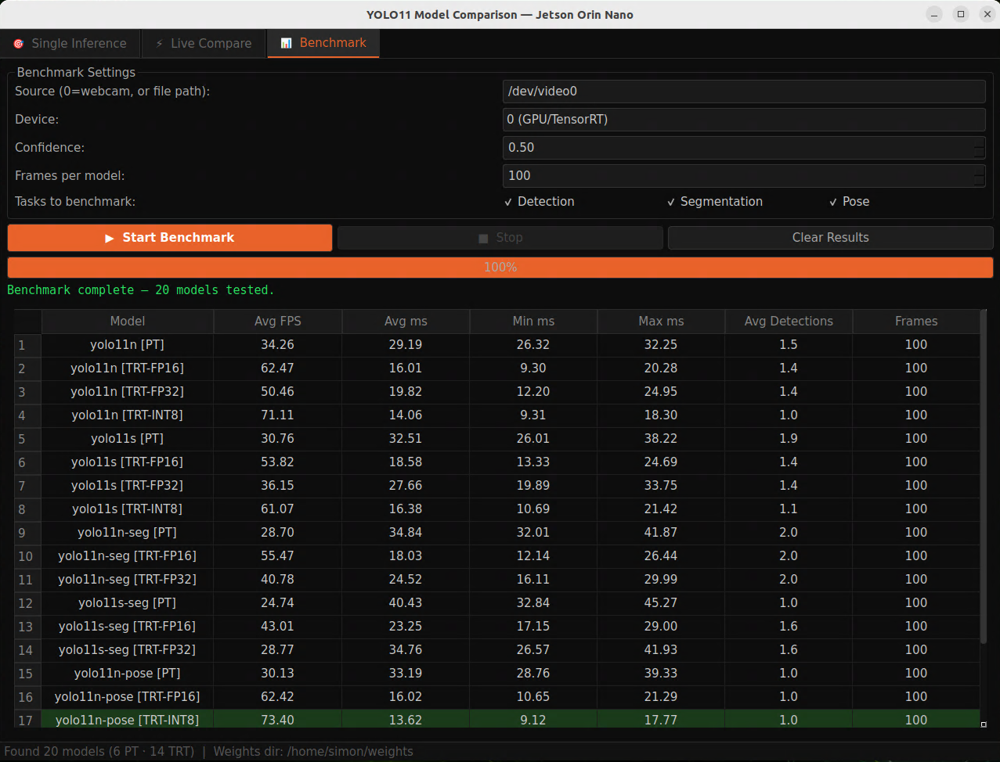

# YOLO11 Model Comparison App — Jetson Orin Nano

A PyQt5 desktop application for benchmarking and comparing YOLO11 detection, segmentation, and pose estimation models on the NVIDIA Jetson Orin Nano. Supports both PyTorch (`.pt`) and TensorRT (`.engine`) inference across all model sizes (n/s/m/l/x) and precisions (FP32/FP16/INT8).


---

## Features

- **Three tabs** — Single Inference, Live Compare, and Benchmark
- **Live side-by-side comparison** of up to 4 models simultaneously from a single camera feed
- **Benchmark mode** with configurable frame count, confidence, and per-task filtering
- **TensorRT support** with FP32, FP16, and INT8 precision selection
- **Auto-discovery** of all `.pt` and `.engine` weight files in the `weights/` folder
- **Real-time stats** — FPS, inference latency (avg/min/max), and object counts
- **Dark UI** optimised for Jetson desktop use
- Handles the Jetson-specific Qt/OpenCV plugin conflict and numpy version issues automatically

---

## Screenshots

### Single Inference


### Live Compare


### Benchmark

---

## Requirements

### Hardware
- NVIDIA Jetson Orin Nano (also works on other Jetson Orin variants)
- USB camera or CSI camera on `/dev/video0`

### Software
- JetPack 5.x or 6.x
- Python 3.10
- Display / X11 session (required for the GUI)

### Python packages

```bash
pip install ultralytics opencv-python-headless PyQt5 "numpy<2.0" --break-system-packages
```

> **Note:** `numpy<2.0` is required because the TensorRT and ONNX Runtime builds shipped with JetPack were compiled against NumPy 1.x. NumPy 2.x introduced an ABI break that causes a `numpy is not available` error at runtime.

> **Note:** Use `opencv-python-headless` rather than `opencv-python`. The full OpenCV package bundles its own Qt libraries which conflict with PyQt5 on Jetson.

---

## Installation

```bash
git clone https://github.com/your-username/yolo11-jetson-comparison.git
cd yolo11-jetson-comparison
mkdir weights
```

### Download YOLO11 weights

```bash
cd weights

# Detection
wget https://github.com/ultralytics/assets/releases/download/v8.3.0/yolo11n.pt
wget https://github.com/ultralytics/assets/releases/download/v8.3.0/yolo11s.pt

# Segmentation
wget https://github.com/ultralytics/assets/releases/download/v8.3.0/yolo11n-seg.pt
wget https://github.com/ultralytics/assets/releases/download/v8.3.0/yolo11s-seg.pt

# Pose
wget https://github.com/ultralytics/assets/releases/download/v8.3.0/yolo11n-pose.pt
wget https://github.com/ultralytics/assets/releases/download/v8.3.0/yolo11s-pose.pt
```

Or download all sizes at once:

```bash
for size in n s m l x; do
    wget https://github.com/ultralytics/assets/releases/download/v8.3.0/yolo11${size}.pt
    wget https://github.com/ultralytics/assets/releases/download/v8.3.0/yolo11${size}-seg.pt
    wget https://github.com/ultralytics/assets/releases/download/v8.3.0/yolo11${size}-pose.pt
done
```

---

## TensorRT Export

Export `.pt` files to TensorRT `.engine` files for best performance on Jetson. Each export takes a few minutes and only needs to be done once. Engines are device-specific — an engine built on one Jetson cannot be used on a different device.

### FP16 (recommended — best speed/accuracy balance)

```bash
python3 -c "
from ultralytics import YOLO
YOLO('weights/yolo11n.pt').export(format='engine', half=True, device=0)
" && mv weights/yolo11n.engine weights/yolo11n-fp16.engine
```

### FP32 (most accurate, slowest)

```bash
python3 -c "
from ultralytics import YOLO
YOLO('weights/yolo11n.pt').export(format='engine', half=False, device=0)
" && mv weights/yolo11n.engine weights/yolo11n-fp32.engine
```

### INT8 (fastest, requires calibration)

```bash
python3 -c "
from ultralytics import YOLO
YOLO('weights/yolo11n.pt').export(format='engine', int8=True, device=0)
" && mv weights/yolo11n.engine weights/yolo11n-int8.engine
```

> **Note:** INT8 export for segmentation models (`-seg`) may fail on JetPack 5.x due to missing TensorRT INT8 kernel implementations for certain layers. Use FP16 for segmentation on JetPack 5.x. This is resolved in JetPack 6.x / TensorRT 10.x.

### Expected export times on Orin Nano

| Precision | Export time | Relative inference speed |
|-----------|------------|--------------------------|
| FP32      | ~3 min     | baseline                 |
| FP16      | ~3 min     | ~2× faster               |
| INT8      | ~8 min     | ~3× faster               |

---

## Weight File Naming Convention

The app auto-discovers files in the `weights/` directory using the following naming convention:

| Task | PyTorch | TRT FP16 | TRT FP32 | TRT INT8 |
|------|---------|----------|----------|----------|
| Detection | `yolo11n.pt` | `yolo11n-fp16.engine` | `yolo11n-fp32.engine` | `yolo11n-int8.engine` |
| Segmentation | `yolo11n-seg.pt` | `yolo11n-seg-fp16.engine` | `yolo11n-seg-fp32.engine` | `yolo11n-seg-int8.engine` |
| Pose | `yolo11n-pose.pt` | `yolo11n-pose-fp16.engine` | `yolo11n-pose-fp32.engine` | `yolo11n-pose-int8.engine` |

Legacy untagged `.engine` files (e.g. `yolo11n.engine`) are also recognised and treated as FP16.

---

## Usage

```bash
python3 yolo11_comparison_app.py
```

### Single Inference tab
Select a task (Detection / Segmentation / Pose), click **Configure Model** to choose a model size and precision, set your input source, and click **Start**.

### Live Compare tab
Click **Select Models…** to choose up to 4 models. All models share a single camera capture thread so only one process holds `/dev/video0` at a time.

### Benchmark tab
Select tasks to benchmark, set frames per model, and click **Start Benchmark**. The app captures a pool of frames from the camera, releases it, then runs each model against the same frames for a fair comparison. Results are displayed in a sortable table with FPS, latency, and detection counts.

---

## Project Structure

```
yolo11-jetson-comparison/
├── yolo11_comparison_app.py   # Main application
├── weights/                   # Place .pt and .engine files here
│   ├── yolo11n.pt
│   ├── yolo11n-fp16.engine
│   └── ...
└── README.md
```

---

## Troubleshooting

**`numpy is not available`**
Downgrade numpy: `pip install "numpy<2.0" --break-system-packages`

**`Could not load Qt platform plugin "xcb"`**
Install headless OpenCV: `pip uninstall opencv-python && pip install opencv-python-headless --break-system-packages`

**`Cannot open source: /dev/video0`**
Check your camera is connected and accessible: `ls -la /dev/video*`
You may need to add your user to the `video` group: `sudo usermod -aG video $USER`

**`WARNING: Unable to automatically guess model task`**
This was a known issue with TensorRT `.engine` files — the app now passes the task explicitly when loading all models.

**INT8 segmentation export fails**
See the note in the TensorRT Export section above. Use FP16 for segmentation on JetPack 5.x.

**App is slow on first inference**
TensorRT engines require a warm-up pass on first use. The app runs one warm-up frame before timing begins in benchmark mode.

---

## Acknowledgements

- [Ultralytics YOLO11](https://github.com/ultralytics/ultralytics)
- [NVIDIA Jetson](https://developer.nvidia.com/embedded/jetson-orin-nano-devkit)
