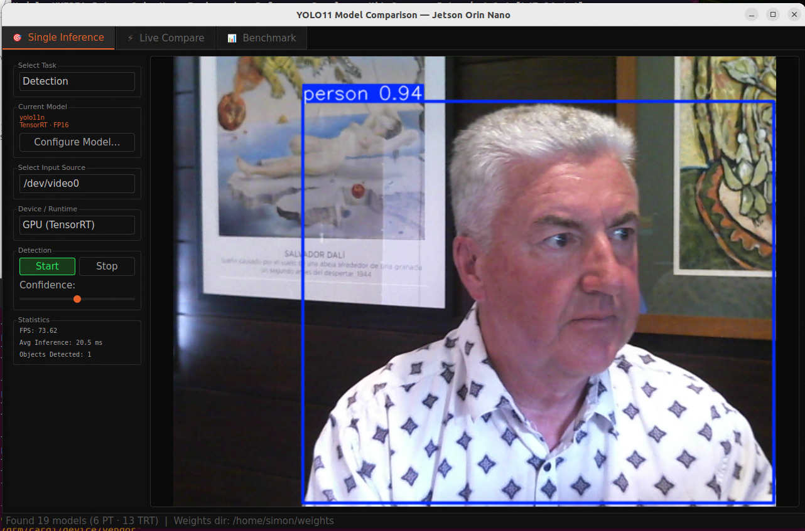
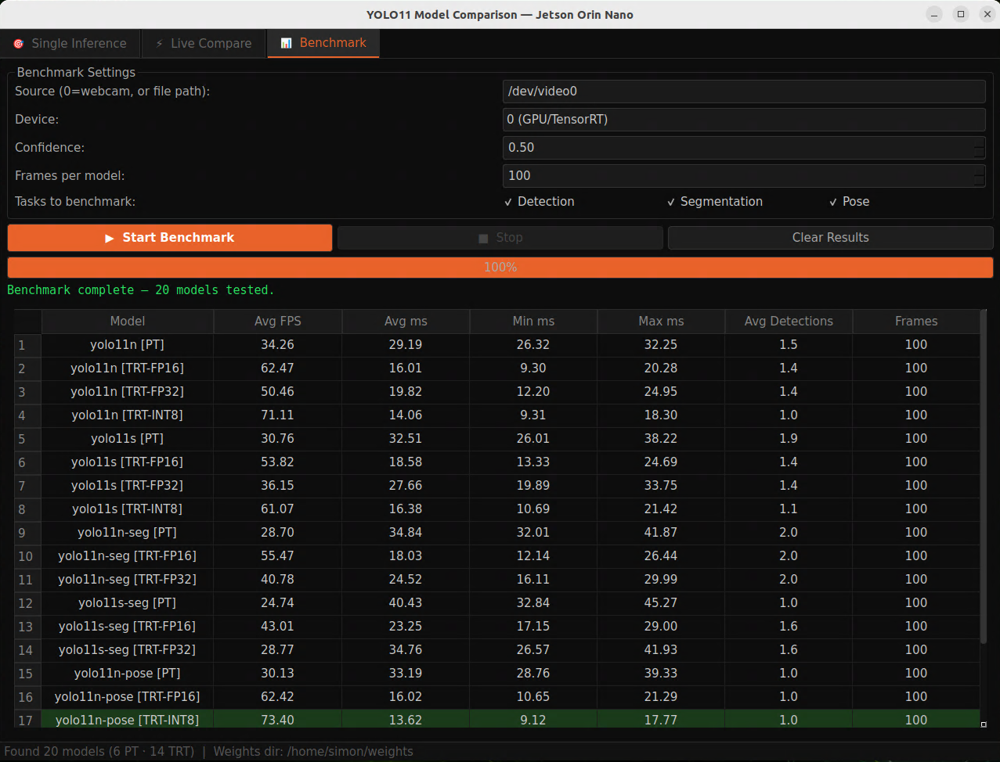

# YOLO Model Comparison App — Jetson Orin Nano

A PyQt5 desktop application for benchmarking and comparing YOLO detection, segmentation, and pose estimation models on the NVIDIA Jetson Orin Nano. Supports **YOLO11** and **YOLO26** model families, with both PyTorch (`.pt`) and TensorRT (`.engine`) inference across all model sizes (n/s/m/l/x) and precisions (FP32/FP16/INT8).


---

## Features

- **Two model families** — YOLO11 and YOLO26, selectable per model slot
- **Three tabs** — Single Inference, Live Compare, and Benchmark
- **Live side-by-side comparison** of up to 4 models simultaneously from a single camera feed
- **Benchmark mode** with configurable frame count, confidence, and per-task filtering
- **TensorRT support** with FP32, FP16, and INT8 precision selection
- **Auto-discovery** of all `.pt` and `.engine` weight files in the `weights/` folder
- **Real-time stats** — FPS, inference latency (avg/min/max), and object counts
- **Dark UI** optimised for Jetson desktop use
- Handles the Jetson-specific Qt/OpenCV plugin conflict and numpy version issues automatically

---

## Screenshots

### Single Inference


### Live Compare


### Benchmark


---

## Model Families

The app supports two YOLO model families. Both use the same task types (Detection, Segmentation, Pose) and the same file naming convention — just with different prefixes.

| Family | Prefix | Example weights |
|--------|--------|-----------------|
| YOLO11 | `yolo11` | `yolo11n.pt`, `yolo11s-seg-fp16.engine` |
| YOLO26 | `yolo26` | `yolo26n.pt`, `yolo26s-pose-fp32.engine` |

The app auto-discovers all files in `weights/` at startup and groups them by family, task, and size. You can compare models across families — e.g. YOLO11n vs YOLO26n — in the Live Compare or Benchmark tabs.

---

## Requirements

### Hardware
- NVIDIA Jetson Orin Nano (also works on other Jetson Orin variants)
- USB camera or CSI camera on `/dev/video0`

### Software
- JetPack 5.x or 6.x
- Python 3.10
- Display / X11 session (required for the GUI)

### Python packages

```bash
pip install ultralytics opencv-python-headless PyQt5 "numpy<2.0" --break-system-packages
```

> **Note:** `numpy<2.0` is required because the TensorRT and ONNX Runtime builds shipped with JetPack were compiled against NumPy 1.x. NumPy 2.x introduced an ABI break that causes a `numpy is not available` error at runtime.

> **Note:** Use `opencv-python-headless` rather than `opencv-python`. The full OpenCV package bundles its own Qt libraries which conflict with PyQt5 on Jetson.

---

## Installation

```bash
git clone https://github.com/smbunn/yolo11_jetson_orin_nano.git
cd yolo11_jetson_orin_nano
```

### Download YOLO11 weights

Downloads YOLO11 PyTorch weight files from the Ultralytics GitHub releases.

```bash
chmod +x download_weights.sh
./download_weights.sh
```

> **Note:** YOLO26 weights must be downloaded manually from the Ultralytics releases page and placed in the `weights/` folder using the naming convention below.

### Export TensorRT engines

Once `.pt` files are in `weights/`, run the export script to build all TensorRT `.engine` files:

```bash
python3 export_all_engines.py
```

This script:
- Sets the Jetson to max performance mode (`nvpmodel -m 0`, `jetson_clocks`)
- Exports FP32, FP16, and INT8 engines for each model
- Skips any engine that already exists
- Skips INT8 for segmentation models (not supported on TRT 10.3)
- Renames output files to the correct naming convention automatically

---

## TensorRT Export

Export `.pt` files to TensorRT `.engine` files for best performance on Jetson. Each export takes a few minutes and only needs to be done once. Engines are device-specific — an engine built on one Jetson cannot be used on a different device.

### Using the export script (recommended)

```bash
python3 export_all_engines.py
```

### Manual export — FP16 (recommended — best speed/accuracy balance)

```bash
python3 -c "
from ultralytics import YOLO
YOLO('weights/yolo11n.pt').export(format='engine', half=True, device=0)
" && mv weights/yolo11n.engine weights/yolo11n-fp16.engine
```

### Manual export — FP32 (most accurate, slowest)

```bash
python3 -c "
from ultralytics import YOLO
YOLO('weights/yolo11n.pt').export(format='engine', half=False, device=0)
" && mv weights/yolo11n.engine weights/yolo11n-fp32.engine
```

### Manual export — INT8 (fastest, requires calibration)

```bash
python3 -c "
from ultralytics import YOLO
YOLO('weights/yolo11n.pt').export(format='engine', int8=True, device=0)
" && mv weights/yolo11n.engine weights/yolo11n-int8.engine
```

> **Note:** INT8 export for segmentation models (`-seg`) may fail on JetPack 5.x due to missing TensorRT INT8 kernel implementations for certain layers. Use FP16 for segmentation on JetPack 5.x. This is resolved in JetPack 6.x / TensorRT 10.x.

### Expected export times on Orin Nano

| Precision | Export time | Relative inference speed |
|-----------|------------|--------------------------|
| FP32      | ~3 min     | baseline                 |
| FP16      | ~3 min     | ~2× faster               |
| INT8      | ~8 min     | ~3× faster               |

---

## Weight File Naming Convention

The app auto-discovers files in `weights/` using this naming convention. The same pattern applies to both YOLO11 and YOLO26.

### YOLO11

| Task | PyTorch | TRT FP16 | TRT FP32 | TRT INT8 |
|------|---------|----------|----------|----------|
| Detection | `yolo11n.pt` | `yolo11n-fp16.engine` | `yolo11n-fp32.engine` | `yolo11n-int8.engine` |
| Segmentation | `yolo11n-seg.pt` | `yolo11n-seg-fp16.engine` | `yolo11n-seg-fp32.engine` | `yolo11n-seg-int8.engine` |
| Pose | `yolo11n-pose.pt` | `yolo11n-pose-fp16.engine` | `yolo11n-pose-fp32.engine` | `yolo11n-pose-int8.engine` |

### YOLO26

| Task | PyTorch | TRT FP16 | TRT FP32 | TRT INT8 |
|------|---------|----------|----------|----------|
| Detection | `yolo26n.pt` | `yolo26n-fp16.engine` | `yolo26n-fp32.engine` | `yolo26n-int8.engine` |
| Segmentation | `yolo26n-seg.pt` | `yolo26n-seg-fp16.engine` | `yolo26n-seg-fp32.engine` | `yolo26n-seg-int8.engine` |
| Pose | `yolo26n-pose.pt` | `yolo26n-pose-fp16.engine` | `yolo26n-pose-fp32.engine` | `yolo26n-pose-int8.engine` |

Replace `n` with `s`, `m`, `l`, or `x` for larger model sizes. Legacy untagged `.engine` files (e.g. `yolo11n.engine`) are also recognised and treated as FP16.

---

## Usage

```bash
python3 yolo11_comparison_app.py
```

### Single Inference tab
Select a task (Detection / Segmentation / Pose), click **Configure Model** to choose a model family, size, and precision, set your input source, and click **Start**.

### Live Compare tab
Click **Select Models…** to choose up to 4 models. Models from different families (e.g. YOLO11n vs YOLO26n) can be compared side by side. All models share a single camera capture thread so only one process holds `/dev/video0` at a time.

### Benchmark tab
Select tasks to benchmark, set frames per model, and click **Start Benchmark**. The app captures a pool of frames from the camera, releases it, then runs each model against the same frames for a fair comparison. Results are displayed in a sortable table with FPS, latency, and detection counts.

---

## Project Structure

```
yolo11_jetson_orin_nano/
├── yolo11_comparison_app.py    # Main application
├── download_weights.sh          # Downloads YOLO11 weights from Ultralytics releases
├── export_all_engines.py        # Exports all .pt files to TensorRT .engine files
├── Get-WeightLinks-Simple.ps1   # Windows PowerShell script to regenerate OneDrive URLs
├── .gitignore                   # Excludes *.pt, *.engine, *.onnx, *.cache from git
├── README.md
└── weights/                     # Model files — downloaded/exported locally, not in git
    ├── yolo11n.pt
    ├── yolo11n-fp16.engine
    ├── yolo26n.pt
    ├── yolo26n-fp16.engine
    └── ...
```

---

## Troubleshooting

### App won't start — Qt plugin error
Run from an X11 session (not SSH without display forwarding). If using RDP, ensure `DISPLAY=:10` is set:

```bash
DISPLAY=:10 python3 yolo11_comparison_app.py
```

### numpy import error
```bash
pip install "numpy<2.0" --break-system-packages
```

### TensorRT engine fails to load
Engines are device-specific. If you copied an engine from another machine, re-export it on this Jetson.

### No camera found
Check `/dev/video0` exists:

```bash
ls -la /dev/video*
```

### Issues / expired download links

If a download link is broken or expired, please open an issue on GitHub and mention which model file failed.

---

## License

MIT
